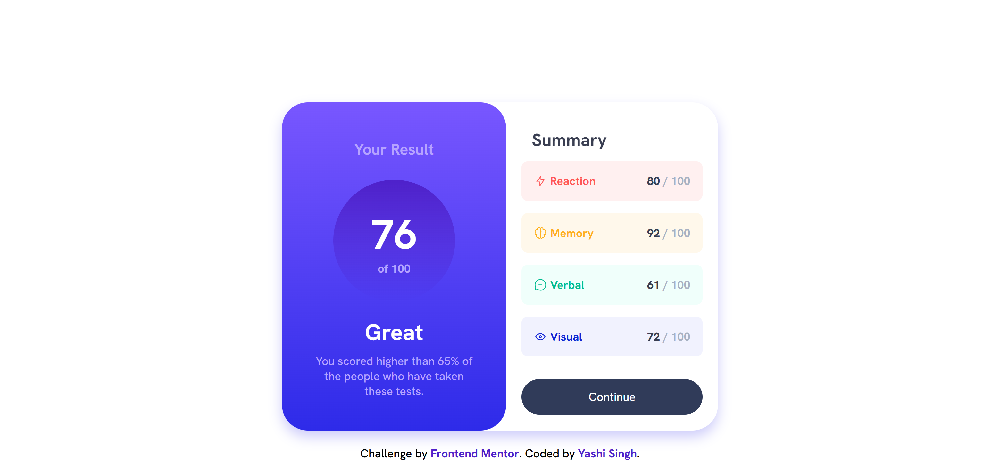
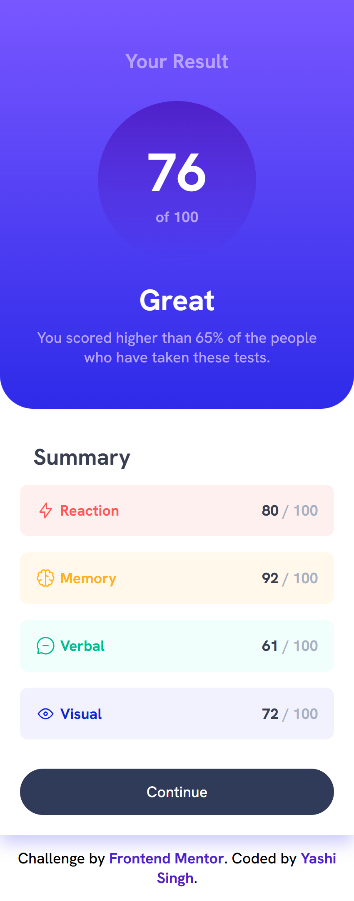

# Frontend Mentor - Results Summary Component Solution

This is my solution to the [Results Summary Component Challenge on Frontend Mentor](https://www.frontendmentor.io/challenges/results-summary-component-CE_K6s0maV). This project is built using **HTML**, **SCSS**, and **JavaScript**, and features dynamically loaded data from a JSON file.

## Table of Contents
- [Overview](#overview)
  - [The Challenge](#the-challenge)
  - [Screenshot](#screenshot)
  - [Links](#links)
- [Installation](#installation)
  - [How to Run SCSS](#how-to-run-scss)
  - [How to Run the Project](#how-to-run-the-project)
- [My Process](#my-process)
  - [Built With](#built-with)
  - [What I Learned](#what-i-learned)
  - [Continued Development](#continued-development)
- [Useful Resources](#useful-resources)
- [Author](#author)
- [Acknowledgments](#acknowledgments)

---

## Overview

### The Challenge

Users should be able to:
- View the optimal layout for the interface depending on their device's screen size
- See hover and focus states for all interactive elements on the page
- **Bonus**: Use the local JSON data to dynamically populate the content

### Screenshot

**Desktop Design**



**Moblie Design**



### Links
- Solution URL: [Solution](https://www.frontendmentor.io/solutions/results-summary-component-1p449I9jNZ)
- Live Site URL: [Live Site](https://yashi-singh-9.github.io/Results-Summary-Component/)

---

## Installation

To run this project locally, follow these steps:

### How to Run SCSS
1. **Ensure Node.js is installed** on your system. [Download Node.js here](https://nodejs.org/).
2. **Install SCSS globally** by running:
   ```bash
   npm install -g sass
   ```
3. **Compile SCSS to CSS**:
   Navigate to the project directory and run:
   ```bash
   sass style.scss style.css
   ```
   This will generate the `style.css` file from the `style.scss` file.

### How to Run the Project
1. Clone this repository or download the project files.
2. Open the `index.html` file in your browser to view the application.
3. Make sure that the `data.json` file and all assets are in the correct directory structure for the dynamic loading to work.

---

## My Process

### Built With
- Semantic **HTML5**
- **SCSS** (CSS preprocessor)
- **JavaScript** for dynamic content
- Mobile-first design principles
- **Flexbox** and **CSS Grid** for layout

### What I Learned

This project helped me improve my understanding of dynamically loading data using JavaScript and working with SCSS for modular and scalable styles. Below are some highlights:

#### Dynamic Data Loading
I learned how to fetch data from a local `data.json` file and dynamically populate the DOM. Here's a snippet:
```javascript
fetch('data.json')
  .then(response => response.json())
  .then(data => {
    const summaryList = document.querySelector('.summary-list');
    data.forEach(item => {
      const listItem = document.createElement('li');
      listItem.className = `summary-item ${item.category.toLowerCase()}`;
      listItem.innerHTML = `
        <div class="item-info">
          
          ${item.category}
        </div>
        <p><span>${item.score}</span> / 100</p>
      `;
      summaryList.appendChild(listItem);
    });
  });
```

#### SCSS Modularity
Using SCSS variables and mixins allowed me to keep the design consistent and maintainable. Example:
```scss
$light-red: hsl(0, 100%, 67%);
$orangey-yellow: hsl(39, 100%, 56%);

.result {
  background: linear-gradient($light-red, $orangey-yellow);
  border-radius: 40px;
}
```

### Continued Development

In future projects, I want to focus on:
- Animating elements with CSS or JavaScript
- Exploring additional preprocessor features like **nested selectors** and **mixins**
- Building accessible and keyboard-friendly interactive elements

---

## Useful Resources

- [MDN Web Docs - Fetch API](https://developer.mozilla.org/en-US/docs/Web/API/Fetch_API) - Helped me fetch JSON data dynamically.
- [The Sass Documentation](https://sass-lang.com/documentation) - A great resource for SCSS concepts.
- [Frontend Mentor](https://www.frontendmentor.io) - For providing this challenge and fostering a great learning community.

---

## Author

- LinkedIn - [Yashi Singh](https://www.linkedin.com/in/yashi-singh-b4143a246)
- Frontend Mentor - [Yashi-Singh-9](https://www.frontendmentor.io/profile/Yashi-Singh-9)

---

## Acknowledgments

Thanks to the Frontend Mentor community for their support and feedback on solutions! Also, a big shoutout to the creators of SCSS and JavaScript for making development fun and efficient.
